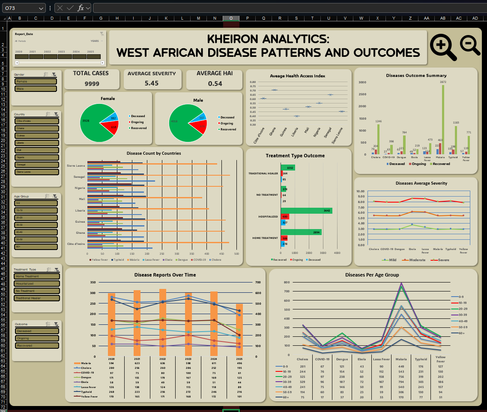
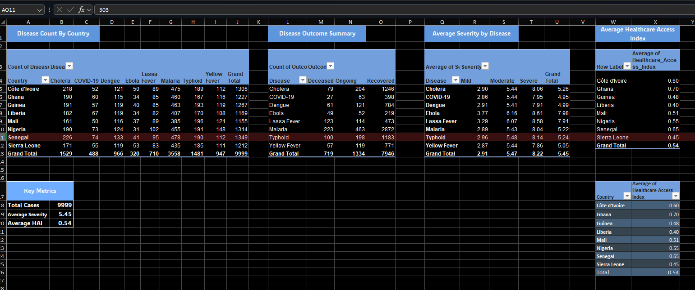
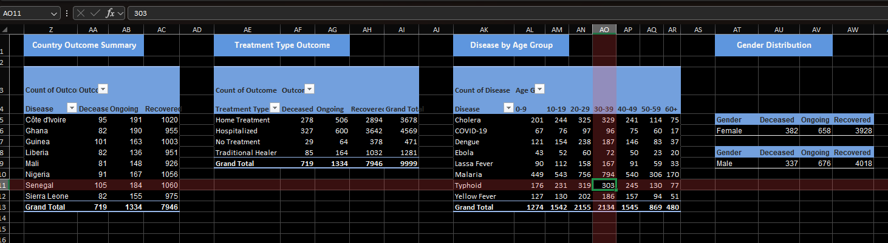
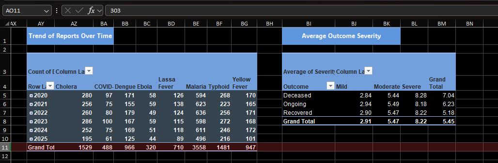

## 📊 West Africa Disease Dashboard

### 🚀 Project Overview
This repository contains an interactive Excel dashboard analyzing synthetic disease data for West Africa. Built using Excel's PivotTables, charts, slicers, and macros, it explores patterns in disease distribution, treatment outcomes, severity, and healthcare access across eight countries from 2020 to 2025.

The dataset mimics real scenarios with 9,999 records, including diseases like Malaria and Ebola. The workbook is structured chronologically: Raw Data → Data Cleaning → Cleaned Data → PivotTables → Dashboard.

## 📈 Dashboard Preview

## 📊 PivotTables & Key Metrics

### Objectives
- Map disease distribution by country and time to identify hotspots (e.g., Malaria's prevalence in tropical areas).
- Evaluate treatment types (e.g., Hospitalized vs. No Treatment) and their impact on outcomes like recovery or mortality.
- Assess disease severity and its link to outcomes, highlighting high-risk diseases like Ebola (average score: 7.98).
- Analyze demographic vulnerabilities by age group and gender.
- Benchmark healthcare access (average HAI: 0.54) and its role in improving recoveries.

### Key Insights
- Total cases: 9,999; Senegal highest (1,349), Mali lowest (1,155).
- Malaria most reported, with highest recoveries and deaths; Lassa Fever second in mortality due to severity (7.91).
- Hospitalization boosts recovery; poor access (e.g., Liberia's 0.40 HAI) worsens outcomes.
- Age 20-29 most affected; higher severity increases death risk.
- Trends show Malaria peaking over six years.

### ⚠️ How to Use
1. Download WestAfricaDiseaseDashboard.xlsm.
2. Open in Excel and *enable macros* for zoom functionality.
3. Navigate to the "Dashboard" worksheet.
4. Use slicers (Gender, Country, etc.) and timeline to filter data—charts and metrics update dynamically.
5. Explore worksheets for the full data pipeline.

### 📂 Files
- West_Africa_Disease_Data.xlsm: The main macro-enabled Excel file.

### 🧮 Technologies Used
- Excel (PivotTables, Charts, Slicers, Timeline, VBA Macros).

### Contact
For questions or collaborations, [Reach out to me on LinkedIn](https://www.linkedin.com/in/0dinakaafam).

[Check my Medium Profile post](https://medium.com/@odinakaafam/analyzing-disease-patterns-in-west-africa-a-data-dashboard-built-with-excel-56acb3ae7b0f) for a detailed walkthrough!
